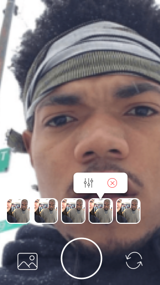
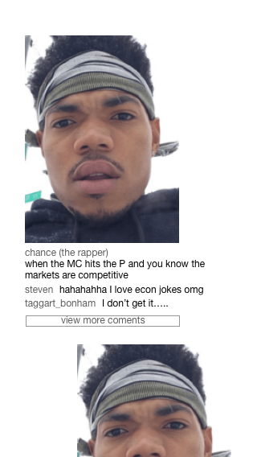
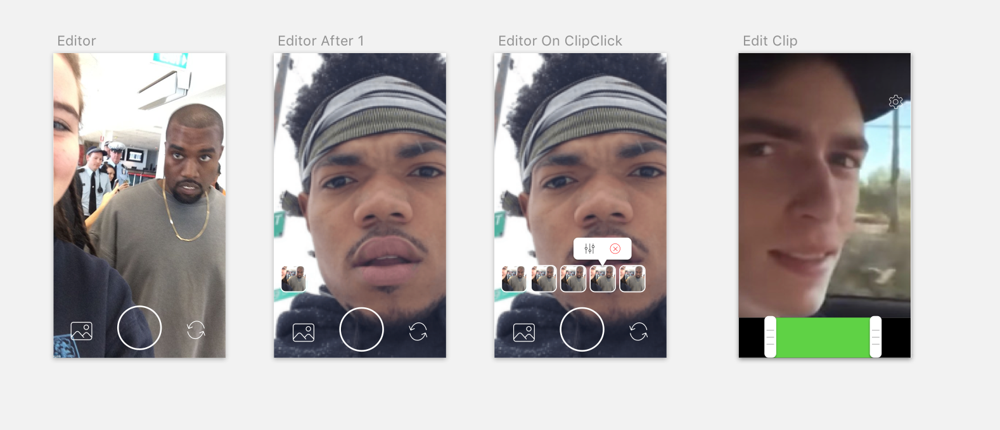

# VidStitch - App

## Project Description and Mockups

VidStitch is a social media application that allows users to quickly share authentic videos with groups of close friends. The application moves beyond large "liking" platforms that pressure people to create an inauthentic user persona in order to impress hundreds or thousands of followers. In contrast, Vidstitch allows people to combine multiple short videos into a compilation to share with trusted friends, without the pressure of curating a certain image. 

The home screen will allow users to record and edit videos on the main recording page. By tapping and dragging each video, the user can "stitch" together multiple videos and make a single, shareable compilation. The application will also have a feed where a user can view their friends' posts, and a profile page where they can see a library of their previous posts.

Below are some mockups of the application: 

* When a user opens the screen and tries to take their first video, they will see the following screen: 

* If a user wants to take a second video, they will see the thumbnail for their previous videos in a stream next to their face. 

* If a user wants to edit a video they can click on the thumbnail. An editing screen will appear. 

* When a user moves to their feed by swiping left, they will see videos posted by their friends. 

### Current progess
Hits the backend and retrieves a 'Hello World!'

## Architecture

We used the react-native starter-kit from the extra credit short assignment. For making api requests, we used react-native's Fetch API.

### Concept
This is a real-time video editing and sharing application. The editing and viewing is done on a mobile device. The splicing, storing, and returning of the videos, users, and posts is done on a backend server.

### Mockups

* note that Editor is actually the main screen

### Components

The project consists of several related components:

#### React-Native App
The mobile application is built on React Native. It will handle the user-facing functionality including registering, editing, posting, and commenting on friend's posts. The video editing will be done in-app using [React-Native Video](https://github.com/shahen94/react-native-video-processing) Processing. The navigation between components will be built on React Native, and the `FETCH/POST` calls will be handled with various React libraries such as Axios.

#### Flask Server
The backend relies on a Flask server, and uses various python libraries for stitching and properly formatting the videos into a single video object to be stored in the Amazon S3 cloud. This server will handle the user registration, friending logic, as well as manage the `FETCH/POST` calls from the app.

#### Amazon S3 Server
The final cut, completely processed video objects will be stored in the Amazon S3 cloud. The S3 server will be able to handle `FETCH/POST` calls to video objects.

## Setup
### Global installs
You will need an http://expo.io account if you do not already have one. 

`brew install node` 

`brew install watchman`

`npm install -g exp`

### Environment setup
Be sure to run `yarn` to install all dependencies, and install the latest version of xcode.

Make sure you have the API running, then run `exp start` to get the main app compiled. 

You're welcome to view the app however you like, but for simplicity's sake we're testing with `exp ios`, which you should run in a separate terminal tab. If you restart the simulator, make sure to Cmd+Q the actual simulator from your desktop before attempting to reload it.

## Authors

* Steven Chun
* Alex Petros
* Taggart Bonham
* Milan Chuttani
* Imanol Avendaño
* Stephen Liao

## Acknowledgments

We thank our families, friends, and Tim.
