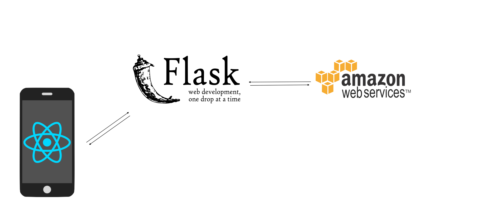

# VidStitch - App

TODO: short project description, some sample screenshots or mockups

## Architecture

TODO:  descriptions of code organization and tools and libraries used

### Concept
This is a real-time video editing and sharing application. The editing and viewing is done on a mobile device. The splicing, storing, and returning of the videos, users, and posts is done on a backend server.

### Components

The project consists of several related components:

#### React-Native App
The mobile application is built on [React Native](https://facebook.github.io/react-native/). It will handle the user-facing functionality including registering, editing, posting, and commenting on friend's posts. The video editing will be done in-app using [React-Native Video Processing](https://github.com/shahen94/react-native-video-processing). The navigation between components will be built on [React Native](https://facebook.github.io/react-native/), and the `FETCH/POST` calls will be handled with various [React](https://reactjs.org/) libraries such as [Axios](https://github.com/axios/axios).

#### Flask Server
The backend relies on a [Flask server](http://flask.pocoo.org/) and uses various [python](https://www.python.org/) libraries for stitching and properly formatting the videos into a single video object to be stored in the [Amazon S3](https://aws.amazon.com/s3/) cloud. This server will handle the user registration, friending logic, as well as manage the `FETCH/POST` calls from the app.

#### Amazon S3 Server
The final cut, completely processed video objects will be stored in the [Amazon S3](https://aws.amazon.com/s3/) cloud. The [S3](https://aws.amazon.com/s3/) server will be able to handle `FETCH/POST` calls to video objects.

## Setup

TODO: how to get the project dev environment up and running, npm install etc

## Deployment

TODO: how to deploy the project

## Authors

* Steven Chun
* Alex Petros
* Taggart Bonham
* Milan Chuttani
* Imanol Avendaño

## Acknowledgments

Here we will thank our families, friends, and Tim.
